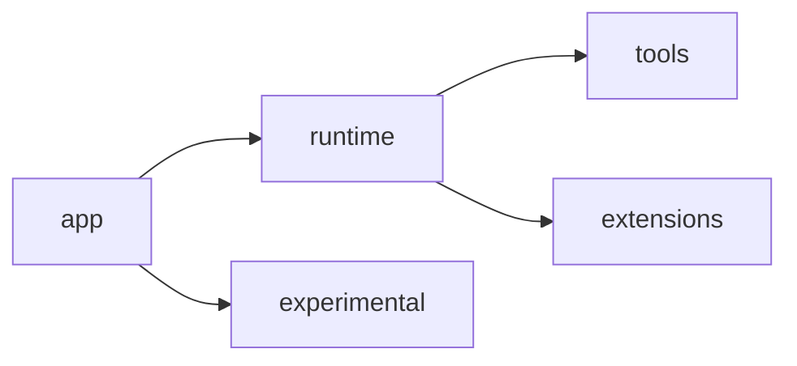

# MyCodeAgent

MyCodeAgent 是一个轻量级的本地编码 Agent 框架，用于研究一个标准循环：

- `app/` — 配置、LLM、注册中心和 CLI 的组装
- `runtime/` — 单 Agent 的回合循环及会话/上下文服务
- `tools/` — 工具边界与内置工具集
- `extensions/` — 可选集成模块，如 MCP、技能（skills）和链路追踪（tracing）
- `experimental/` — 非标准系统，如团队运行环境

本项目目标并非追求平台广度，而是一个可读、可修改的框架，保持默认路径简洁小巧。

## 标准架构



- 默认的单 Agent 启动路径为 `app -> runtime -> tools`。
- `extensions/` 为可选模块，可在不破坏核心循环的情况下禁用。
- `experimental/teams` 虽然存在，但有意被置于标准运行时体系之外。
- 默认宿主实现位于 `runtime/host.py`。

## 核心框架功能

- 通过 `runtime/loop.py` 运行 ReAct 风格的单 Agent 循环
- 通过 `runtime/prompt_builder.py`、`runtime/input_preprocess.py`、`runtime/observation_store.py` 和 `runtime/summary.py` 构建提示词和上下文服务
- 通过 `runtime/session.py` 持久化和恢复会话
- 通过 `tools/executor.py` 执行工具
- 支持内置的文件/代码工具、Bash、任务列表及 ask-user 交互

## 可选扩展

- `extensions/mcp/`：MCP 服务器注册与提示词整形
- `extensions/skills/`：本地技能发现与提示词注入
- `extensions/tracing/`：链路追踪日志记录及空追踪回退

这些均为可选层，框架在它们被禁用时仍应正常运行。

## 实验性运行环境

`experimental/teams/` 包含多 Agent 及队友运行环境：

- 依赖团队运行环境的 `Task`（任务）委托模式
- 团队编排、路由、工作收集、审批及持久化
- CLI 辅助命令 `/team ...` 和 `/delegate`

该层默认关闭，启用它应是一个明确的选择，而非基础叙述的一部分。

## 仓库目录结构

```text
app/                 bootstrap 及 CLI 入口
main.py              标准根 CLI 入口点
runtime/             标准单 Agent 运行环境
tools/               工具注册中心、执行器及内置工具
extensions/          可选 MCP / 技能 / 链路追踪层
experimental/        非标准运行环境系统
core/                共享配置、环境变量、LLM 及基础基础设施
tests/runtime/       运行时相关测试
tests/tools/         工具边界测试
tests/extensions/    可选扩展测试
tests/experimental/  团队运行时测试
```

## 快速开始

### 环境要求

- Python 3.10+
- 推荐使用 `uv`

### 安装

```bash
git clone <仓库地址>
cd MyCodeAgent
uv venv
source .venv/bin/activate
uv pip install -r requirements.txt
```

### 环境变量

设置你的 LLM 提供商所需的配置。具体变量名取决于 `core/config.py` 及你选择的提供商。

常见示例：

```bash
export LLM_PROVIDER="openai"
export LLM_MODEL_ID="gpt-4.1"
export LLM_API_KEY="..."
```

可选配置项：

```bash
export ENABLE_AGENT_TEAMS="true"   # 实验性功能，默认关闭
export TRACE_ENABLED="true"
```

### 运行 CLI

```bash
python main.py
```

示例：

```bash
python main.py --show-raw
python main.py --provider zhipu --model GLM-4.7
```

## 验证测试

推荐的分层检查：

```bash
pytest tests/runtime tests/tools tests/extensions -q
pytest tests/experimental -q
```

核心冒烟测试：

```bash
pytest tests/test_protocol_compliance.py tests/test_bash_tool.py -q
```

## 设计原则

- 保持单一的标准单 Agent 循环
- 将可选系统置于显式边界之后
- 不允许实验性运行环境影响默认的启动路径
- 借鉴大型 Agent 的设计思路，但绝不引入它们的复杂性
