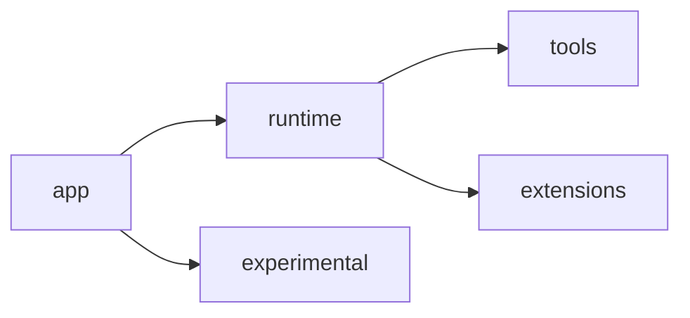

# MyCodeAgent

MyCodeAgent is a small local coding-agent harness for studying one canonical loop:

- `app/` wires config, LLM, registry, and CLI
- `runtime/` owns the single-agent turn loop and session/context services
- `tools/` provides the tool boundary and built-in tools
- `extensions/` contains optional integrations such as MCP, skills, and tracing
- `experimental/` contains non-canonical systems such as the team runtime

The project goal is not platform breadth. It is a readable, hackable harness that keeps the default path small.

## Canonical Architecture



- The default single-agent bootstrap path is `app -> runtime -> tools`.
- `extensions/` are optional and can be disabled without breaking the core loop.
- `experimental/teams` exists, but it is intentionally outside the canonical runtime story.
- The default host implementation lives in `runtime/agent_host.py`.

## What The Core Harness Does

- Runs a ReAct-style single-agent loop through `runtime/runner.py`
- Builds prompts and context through `runtime/prompt.py` and `runtime/context.py`
- Persists and restores sessions through `runtime/session.py`
- Executes tools through `tools/executor.py`
- Supports built-in file/code tools, bash, todos, and ask-user interactions

## Optional Extensions

- `extensions/mcp/`: MCP server registration and prompt shaping
- `extensions/skills/`: local skill discovery and prompt injection
- `extensions/tracing/`: trace logging and null tracing fallback

These are optional layers. The harness should still run with them disabled.

## Experimental Runtime

`experimental/teams/` contains the multi-agent and teammate runtime:

- `Task` delegation modes that depend on the team runtime
- team orchestration, routing, work collection, approvals, and persistence
- CLI helpers for `/team ...` and `/delegate`

This layer is off by default. Enabling it should be an explicit choice, not part of the base narrative.

## Repository Map

```text
app/                 bootstrap and CLI entrypoints
main.py              canonical root CLI entrypoint
runtime/             canonical single-agent runtime
tools/               tool registry, executor, and built-in tools
extensions/          optional MCP / skills / tracing layers
experimental/        non-canonical runtime systems
core/                shared config, env, LLM, and base infrastructure
tests/runtime/       runtime-focused tests
tests/tools/         tool boundary tests
tests/extensions/    optional extension tests
tests/experimental/  team runtime tests
```

## Quick Start

### Requirements

- Python 3.10+
- `uv` recommended

### Setup

```bash
git clone <repository-url>
cd MyCodeAgent
uv venv
source .venv/bin/activate
uv pip install -r requirements.txt
```

### Environment

Set the LLM settings your provider requires. The exact variable names depend on `core/config.py` and your chosen provider.

Common examples:

```bash
export LLM_PROVIDER="openai"
export LLM_MODEL_ID="gpt-4.1"
export LLM_API_KEY="..."
```

Optional flags:

```bash
export ENABLE_AGENT_TEAMS="true"   # experimental, off by default
export TRACE_ENABLED="true"
```

### Run The CLI

```bash
python main.py
```

Examples:

```bash
python main.py --show-raw
python main.py --provider zhipu --model GLM-4.7
```

## Verification

Recommended tiered checks:

```bash
pytest tests/runtime tests/tools tests/extensions -q
pytest tests/experimental -q
```

Core-only smoke checks:

```bash
pytest tests/test_protocol_compliance.py tests/test_bash_tool.py -q
```

## Design Constraints

- Keep one canonical single-agent loop.
- Keep optional systems behind explicit boundaries.
- Do not let experimental runtime shape the default bootstrap path.
- Borrow ideas from larger agents, but do not import their complexity.
