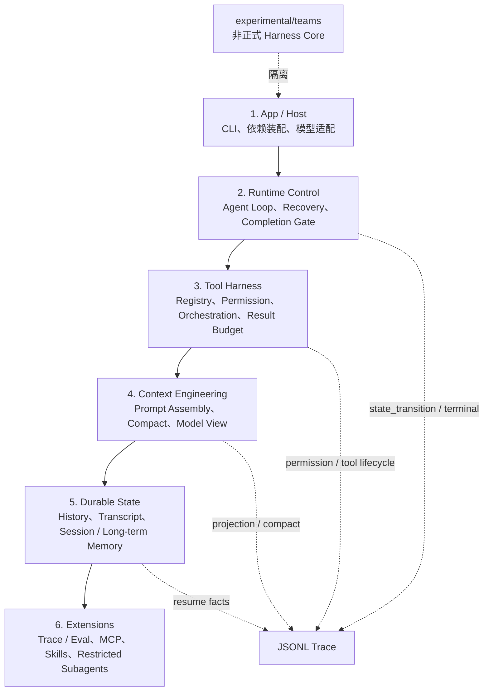

# MyCodeAgent

MyCodeAgent 是一个用于展示 **Harness Engineering** 的本地 Python 项目。它研究的不是“模型会不会写代码”，而是模型之外的运行时如何让代码 Agent **可控、可恢复、可验证、可解释**。

普通 ReAct 循环通常只有：

```text
model -> tool -> observation -> model -> final answer
```

MyCodeAgent 在这条链路外增加完成判定、权限、工具编排、上下文投影、持久化恢复和受限子 Agent。模型负责提出动作与完成候选，Harness 才拥有执行和终止决定权。

## 六层架构



正式单 Agent 调用链只有一条：

```text
main.py -> app.cli -> runtime.host.CodeAgent
        -> RuntimeRunner -> ContextEngine -> LLM
        -> ToolOrchestrator -> History / Transcript -> Completion Gate
```

## 核心能力

| 机制 | Runtime 保证 | 关键证据 |
|---|---|---|
| Agent Loop | 显式 transition、有限恢复、final 必须通过 Completion Gate | [`agent-loop.json`](docs/traces/agent-loop.json) |
| Tool Harness | 输入级权限、失败关闭、安全批次、顺序保持、结果预算 | [`tool-harness.json`](docs/traces/tool-harness.json) |
| Context Engineering | 完整历史不被 compact 删除，模型只读投影视图 | [`context-engineering.json`](docs/traces/context-engineering.json) |
| Memory / Subagent | Transcript 恢复事实、Session/Long-term 生命周期分离、子 Agent 隔离 | [`memory-subagent.json`](docs/traces/memory-subagent.json) |

它与普通 ReAct 的关键区别：

- **完成不是一句话**：模型输出 final 只生成 `CompletionCandidate`，验证证据不足会继续循环或明确失败。
- **工具不是模型直连环境**：`ToolExecutor` 在执行前做权限决策，`ToolOrchestrator` 决定并发、顺序和预算。
- **上下文不是一份不断增长的 messages**：History、Transcript、Session Memory、Long-term Memory 和 Model View 是不同生命周期的数据。
- **失败不是异常后重开循环**：模型错误、权限拒绝、工具失败和恢复都进入 Trace，并受明确预算限制。

对照实验见 [`docs/portfolio/REACT_COMPARISON.md`](docs/portfolio/REACT_COMPARISON.md)。

## 十分钟阅读路径

1. 本 README：理解问题、分层和证据入口。
2. [`docs/HARNESS.md`](docs/HARNESS.md)：查看当前有效架构与正式边界。
3. 四个模块设计：
   - [`Agent Loop 与 Completion Gate`](docs/portfolio/AGENT_LOOP.md)
   - [`Tool Harness、权限与编排`](docs/portfolio/TOOL_HARNESS.md)
   - [`Context Engineering、Compact 与 Model View`](docs/portfolio/CONTEXT_ENGINEERING.md)
   - [`Transcript、Memory 与 Subagent`](docs/portfolio/MEMORY_SUBAGENT.md)
4. [`Demo 运行说明`](demo/README.md) 与 [`Trace 协议`](docs/HARNESS_TRACE_PROTOCOL.md)。
5. [`项目边界与测试口径`](docs/portfolio/PROJECT_STATUS.md)。

## 确定性 Demo

不需要真实 API Key：

```bash
.venv/bin/python demo/harness_portfolio.py all
```

分别运行并保存 JSON Trace：

```bash
.venv/bin/python demo/harness_portfolio.py agent-loop
.venv/bin/python demo/harness_portfolio.py tool-harness
.venv/bin/python demo/harness_portfolio.py context-engineering
.venv/bin/python demo/harness_portfolio.py memory-subagent
```

每个 Demo 都输出 `summary` 和逐事件 `trace`，不是只打印最终答案。

## 运行项目

环境要求：Python 3.10+，推荐使用 `uv`。

```bash
uv venv
source .venv/bin/activate
uv pip install -r requirements-dev.txt
cp .env.example .env
```

配置 `LLM_PROVIDER`、`LLM_MODEL_ID`、`LLM_API_KEY` 后运行真实交互：

```bash
.venv/bin/python main.py
```

Demo 和测试不需要 API Key。

## 测试

```bash
.venv/bin/python -m pytest -q
```

按边界运行：

```bash
.venv/bin/python -m pytest tests/runtime tests/tools tests/scenarios -q
.venv/bin/python -m pytest tests/extensions -q
.venv/bin/python -m pytest tests/experimental -q
```

截至 2026-06-12，测试套件收集 `754` 个测试：`644` 个正式 Core/Tool/Extension/Scenario 测试，`110` 个 experimental Teams 测试。详细口径见 [`PROJECT_STATUS.md`](docs/portfolio/PROJECT_STATUS.md)。

## 项目边界

正式 Harness Core 位于 `runtime/`、`tools/`、`app/` 和 `extensions/`。`experimental/teams/` 保留为研究资料，不是默认 Task/Subagent 的正式实现。

项目不追求完整复刻 Claude Code。当前明确不实现 StreamingToolExecutor、跨模型状态重建、OS 级沙箱、远程 worker、复杂 Teams/Coordinator、远程遥测和产品级 UI。取舍原因是把代码和测试集中在可解释的 Harness 机制，而不是复制一个闭源产品的功能表。
