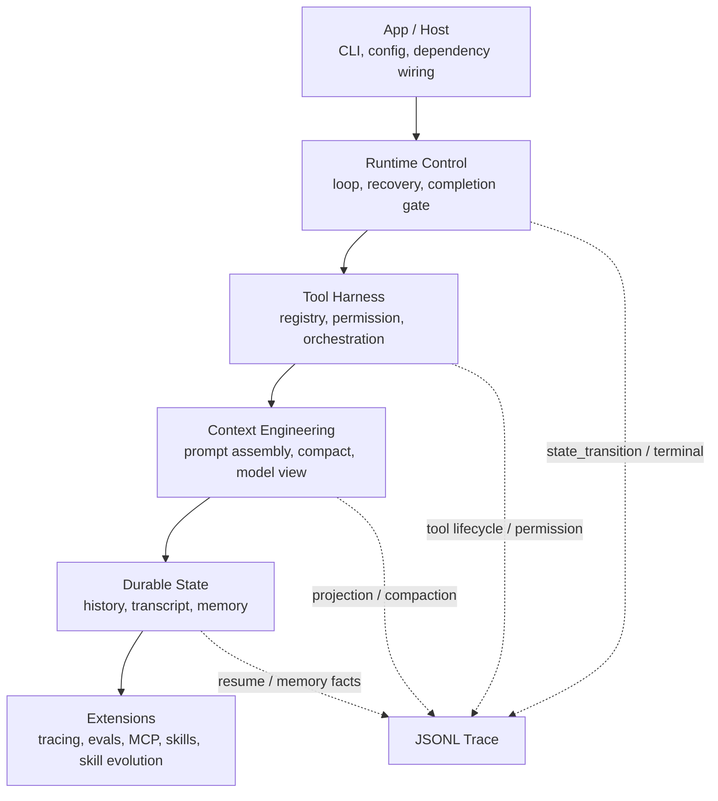

# MyCodeAgent

MyCodeAgent is a local-first coding agent runtime written in Python. It is not a model demo or a thin ReAct wrapper. The project focuses on the engineering harness around an LLM: tool execution, permission checks, context projection, traceability, completion verification, durable memory, subagent isolation, and experimental skill evolution.

The core question is:

> How do we make a coding agent controllable, recoverable, observable, and testable when the model itself is probabilistic?

This repository grew out of the lessons summarized in [Agent应用开发实践踩坑与经验分享](https://github.com/datawhalechina/hello-agents/blob/main/Extra-Chapter/Extra09-Agent%E5%BA%94%E7%94%A8%E5%BC%80%E5%8F%91%E5%AE%9E%E8%B7%B5%E8%B8%A9%E5%9D%91%E4%B8%8E%E7%BB%8F%E9%AA%8C%E5%88%86%E4%BA%AB.md): start with the shortest working loop, make every failure diagnosable, and only add machinery after a real runtime need appears.

## Highlights

- **Runtime-controlled agent loop**: the model proposes actions, but the harness owns state transitions, retries, terminal conditions, and completion gates.
- **Tool harness**: centralized tool registry, permission decisions, orchestration, result budgeting, and safer command execution.
- **Context engineering**: history is durable; the model sees a projected view with compaction, memory injection, and traceable prompt assembly.
- **Trace-first debugging**: JSONL trace events expose model calls, tool calls, permission decisions, context compaction, state transitions, and terminal reasons.
- **Durable memory**: transcript resume, session memory, and long-term memory are separated by lifecycle.
- **Skills and MCP**: runtime-extensible skill loading, overlay support, and MCP tool integration.
- **Experimental Skill Evolution**: an opt-in framework that observes traces, proposes skill patches, evaluates candidates, and writes evolved skills to an overlay instead of modifying source skills.

## Architecture



Main execution path:

```text
main.py -> app.cli -> runtime.host.CodeAgent
        -> RuntimeRunner -> ContextEngine -> LLM
        -> ToolOrchestrator -> History / Transcript -> Completion Gate
```

The formal harness core lives in `app/`, `runtime/`, `tools/`, and `extensions/`. `experimental/` is kept as research material and is not part of the stable runtime contract.

## Quick Start

Requirements:

- Python 3.10+
- `uv` recommended, plain `pip` also works

```bash
uv venv
source .venv/bin/activate
uv pip install -r requirements-dev.txt
cp .env.example .env
```

Configure your model provider in `.env`:

```env
LLM_PROVIDER=openai
LLM_MODEL_ID=your-model
LLM_API_KEY=your-key
```

Run the CLI:

```bash
.venv/bin/python main.py
```

Deterministic demos do not require an API key:

```bash
.venv/bin/python demo/harness_portfolio.py all
```

## Skill Evolution

Skill Evolution is experimental and disabled by default.

Enable it with either:

```bash
.venv/bin/python main.py --skill-evolution
```

or:

```bash
SKILL_EVOLUTION_ENABLED=1 .venv/bin/python main.py
```

Design constraints:

- Source skills under `skills/` are read-only.
- Evolved skills are written to `memory/skill_evolution/active/`.
- Each skill has an independent state machine, buffer, proposal manager, and observer.
- User-directed hotfixes and agent-inferred evolution are separate paths.
- Candidate versions can be promoted or rolled back.
- Lifecycle reports are written in report-only mode; no automatic skill-library consolidation runs yet.

## Testing

Run the full suite:

```bash
.venv/bin/python -m pytest tests/ -q
```

Current status:

```text
861 passed, 6 subtests passed
```

Focused suites:

```bash
.venv/bin/python -m pytest tests/runtime tests/tools tests/scenarios -q
.venv/bin/python -m pytest tests/extensions -q
.venv/bin/python -m pytest tests/experimental -q
```

## Documentation Map

- [Harness architecture](docs/HARNESS.md)
- [Trace protocol](docs/HARNESS_TRACE_PROTOCOL.md)
- [Agent loop and completion gate](docs/portfolio/AGENT_LOOP.md)
- [Tool harness](docs/portfolio/TOOL_HARNESS.md)
- [Context engineering](docs/portfolio/CONTEXT_ENGINEERING.md)
- [Memory and subagents](docs/portfolio/MEMORY_SUBAGENT.md)
- [ReAct comparison](docs/portfolio/REACT_COMPARISON.md)
- [Project status](docs/portfolio/PROJECT_STATUS.md)

## Roadmap

- Harden Skill Evolution with longer-running end-to-end evaluations.
- Add report-first proposal curation so repeated hotfixes can be consolidated into general skill guidance.
- Improve trace viewers and failure summaries for large sessions.
- Add more deterministic scenario tests for permissions, model recovery, and context compaction.
- Expand memory lifecycle hooks without turning memory into an opaque global context blob.
- Keep experimental multi-agent work isolated until the runtime contract is simpler and better tested.

## Non-Goals

MyCodeAgent does not try to clone a full commercial coding product. It intentionally avoids product UI, remote workers, OS-level sandboxing, always-on telemetry, and large multi-agent orchestration in the stable core. Those can be added later only when the runtime evidence justifies them.

## Acknowledgements

MyCodeAgent is influenced by the broader coding-agent ecosystem:

- [Hello-Agents](https://github.com/datawhalechina/hello-agents), especially the learning path and the project write-up [Agent应用开发实践踩坑与经验分享](https://github.com/datawhalechina/hello-agents/blob/main/Extra-Chapter/Extra09-Agent%E5%BA%94%E7%94%A8%E5%BC%80%E5%8F%91%E5%AE%9E%E8%B7%B5%E8%B8%A9%E5%9D%91%E4%B8%8E%E7%BB%8F%E9%AA%8C%E5%88%86%E4%BA%AB.md).
- [Claude Code](https://github.com/anthropics/claude-code), for showing how powerful terminal-native coding agents can be.
- [Hermes Agent](https://github.com/NousResearch/hermes-agent), for its memory lifecycle, skill curation, and self-improving agent ideas.
- [OpenClaw](https://github.com/openclaw/openclaw), for local-first assistant and skill ecosystem exploration.
- Open-source agent builders who publish traces, failures, prompts, and hard-earned engineering lessons instead of only polished demos.

## License

This project is released under the [MIT License](LICENSE).
